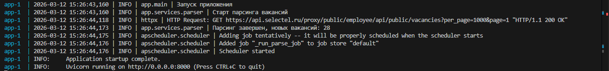
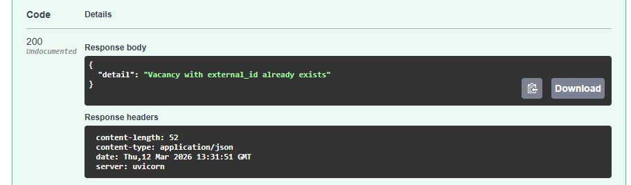

# Отчёт по отладке приложения — Габов Михаил

## Баг 1 — [config.py](selectest-api/app/core/config.py) — опечатка в `validation_alias`

**Проблема:** При запуске приложение падает с ошибкой:

```
pydantic_core._pydantic_core.ValidationError: 1 validation error for Settings
database_url
  Extra inputs are not permitted
```

Pydantic ищет переменную `DATABSE_URL` (опечатка), не находит её в `.env`, и воспринимает корректный `DATABASE_URL` как лишнее поле.

**Файл и строка:** `app/core/config.py:14`

**Код до:**
```python
validation_alias="DATABSE_URL",
```

**Код после:**
```python
validation_alias="DATABASE_URL",
```

---

## Баг 2 — [config.py](selectest-api/app/core/config.py) — несуществующая БД в дефолтном значении

**Проблема:** Дефолтное значение `database_url` содержит несуществующую БД `postgres_typo`. При отсутствии `.env` приложение запустится, но упадёт при подключении к базе данных с непонятной ошибкой.

**Файл и строка:** `app/core/config.py:13`

**Код до:**
```python
database_url: str = Field(
    "postgresql+asyncpg://postgres:postgres@db:5432/postgres_typo",
    validation_alias="DATABASE_URL",
)
```

**Код после:**
```python
database_url: str = Field(validation_alias="DATABASE_URL")
```

---

## Баг 3 — [requirements.txt](selectest-api/requirements.txt) — мёртвая строка с несуществующей версией

**Проблема:** `python_version < "3.8"` никогда не выполняется на Python 3.11 (версия уже указана в dockerfile). fastapi==999.0.0 версия не существует. Кроме того, `fastapi` уже указан выше без версии.

**Файл и строка:** `requirements.txt:10`

**Код до:**
```
fastapi==999.0.0; python_version < "3.8"
```

**Код после:** строка удалена.

---

## Баг 4 — [parser.py:43](selectest-api/app/services/parser.py#L43) — обращение к атрибуту `None`

**Проблема:** После первого успешного запуска парсер падает с ошибкой:

```
AttributeError: 'NoneType' object has no attribute 'name'
```

В `ExternalVacancyItem` поле `city` объявлено как `Optional[ExternalCity]` — API Selectel может вернуть `null`. Код не проверяет это перед обращением к `item.city.name`.

**Файл и строка:** `app/services/parser.py:43`

**Код до:**
```python
"city_name": item.city.name.strip(),
```

**Код после:**
```python
"city_name": item.city.name.strip() if item.city else None,
```

---

## Баг 5 — [parser.py:31](selectest-api/app/services/parser.py#L31) — `httpx.AsyncClient` не закрывается

**Проблема:** `httpx.AsyncClient` создаётся напрямую без `async with`. Соединение никогда не закрывается явно — при каждом запуске парсера накапливаются незакрытые соединения.

**Файл и строка:** `app/services/parser.py:31`

**Код до:**
```python
client = httpx.AsyncClient(timeout=timeout)
```

**Код после:**
```python
async with httpx.AsyncClient(timeout=timeout) as client:
```

---

## Баг 6 — [scheduler.py:13](selectest-api/app/services/scheduler.py#L13) — минуты читаются как секунды

**Проблема:** В `settings` переменная называется `parse_schedule_minutes` (минуты), но передаётся в параметр `seconds=`. Парсер запускается каждые 5 секунд вместо 5 минут.

**Файл и строка:** `app/services/scheduler.py:13`

**Код до:**
```python
seconds=settings.parse_schedule_minutes,
```

**Код после:**
```python
minutes=settings.parse_schedule_minutes,
```

---

## Баг 7 — [vacancies.py:52-55](selectest-api/app/api/v1/vacancies.py#L52-55) — нарушение контракта API

**Проблема:** При попытке создать вакансию с уже существующим `external_id` эндпоинт возвращает `JSONResponse` со статусом `200` и телом `{"detail": "..."}`. Это нарушает `response_model=VacancyRead` и некорректный статус для конфликта. В Swagger ответ помечен как `Undocumented`.


**Файл и строка:** `app/api/v1/vacancies.py:52-55`

**Код до:**
```python
return JSONResponse(
    status_code=status.HTTP_200_OK,
    content={"detail": "Vacancy with external_id already exists"},
)
```

**Код после:**
```python
raise HTTPException(
    status_code=status.HTTP_409_CONFLICT,
    detail="Vacancy with external_id already exists",
)
```
(импорт JSONResponse убирать не стал)

---

## Баг 8 — [crud/vacancy.py:72](selectest-api/app/crud/vacancy.py#L72) — неправильный тип `existing_ids`

**Проблема:** Обнаружен статическим анализатором `mypy`:

```
Incompatible types in assignment (expression has type "dict[Never, Never]", variable has type "set[Any]")
```

В ветке `if` переменная получает тип `set`, в ветке `else` — пустой `dict {}`. Функционально работает случайно (`x in {}` и `x in set()` оба возвращают `False`), но тип неправильный.

**Файл и строка:** `app/crud/vacancy.py:72`

**Код до:**
```python
existing_ids = {}
```

**Код после:**
```python
existing_ids = set()
```

---

## Потенциальное улучшение — [parser.py:25-61](selectest-api/app/services/parser.py#L25-61)

`ValidationError` не входит в список перехватываемых исключений. Если API Selectel вернёт неожиданную структуру данных, исключение уйдёт за пределы парсера. Но возможно так и задумано

---

## Итог

- 8 багов найдены и исправлены
- Приложение запускается без ошибок
- Все CRUD-операции работают и возвращают корректные HTTP-статусы